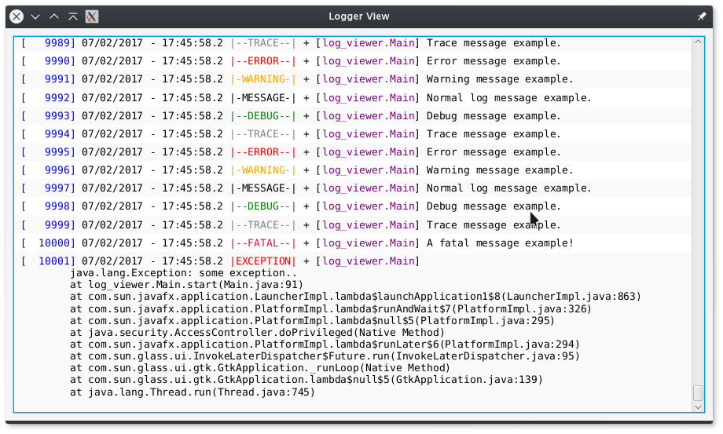

# README

This is a quick example implementation of using the `Log_Window_Interface` 
from [EADjLib](https://github.com/An7ar35/eadjlib)'s Logger module.

In this instance the main class running the GUI also implements 
the `Log_Window_Interface`. The `append(..)` methods are implemented to 
format and pass the log message to the GUI.

EADjLib 0.1 is packaged in this repo along with the 'iml' file from Intellij IDEA.
You should double check that the library is properly linked to the project
in any case (File > Project Structure). 